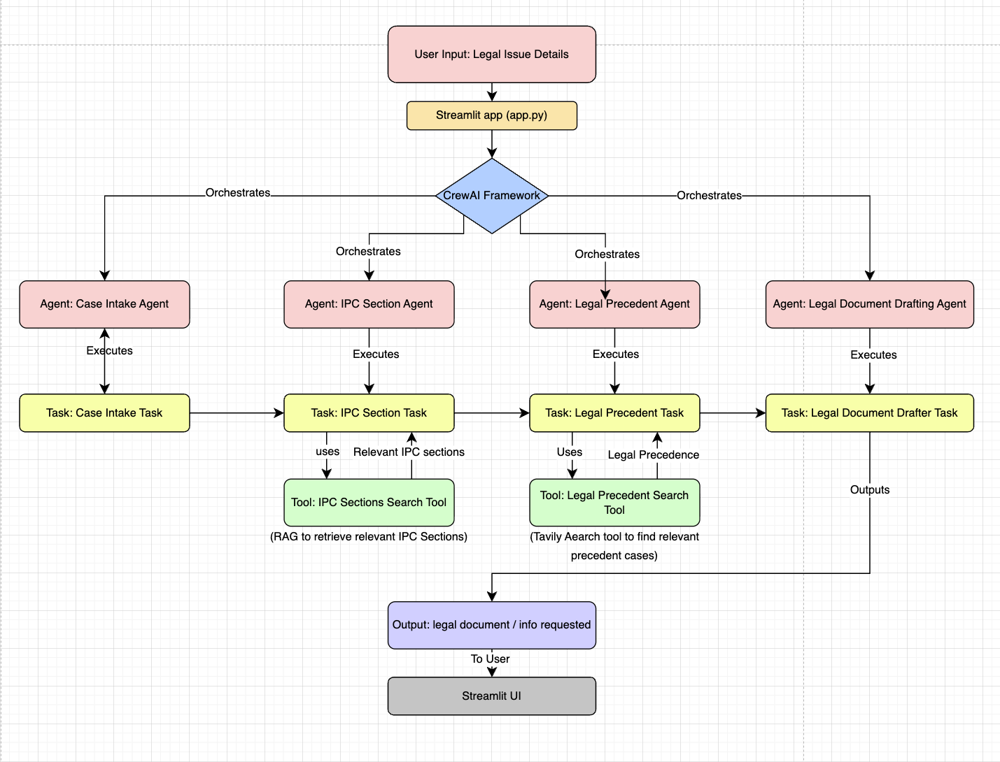

# 🏛️ AI Legal Assistant (Indian Penal Code) — CrewAI Powered

A locally hosted AI legal assistant designed to help users understand and resolve legal issues based on the **Indian Penal Code (IPC)**. Built using the powerful **CrewAI** framework, this project orchestrates multiple expert agents—making Indian law accessible through simple natural language queries.

---
## 🌐 Try It Live

**One-click Web App:**  
👉 [https://ai-legal-assistant-48b9.onrender.com/](https://ai-legal-assistant-48b9.onrender.com/)

Interact with the tool and explore Indian Penal Code guidance, precedent search, or legal document drafting through a simple Streamlit interface—no installation needed!

---
## 🌟 Project Overview

This assistant lets anyone describe a real-world legal scenario (such as theft, threat, harassment, or property issues) in plain language. The system then automatically analyzes the case, retrieves relevant IPC sections, finds matching legal precedents, and, if requested, drafts legal documents—all directly in your browser via a simple Streamlit UI.

*Built for privacy, transparency, and easy use/extension.*

---

## 🔄 Workflow Explained

Below is an image illustrating the internal workflow and system architecture:



**Workflow Summary:**
- **User Input**: You submit legal issue details through a Streamlit web app.
- **CrewAI Orchestration**: The framework orchestrates four specialized agents:
    - **Case Intake Agent**: Reads and structures your scenario.
    - **IPC Section Agent**: Identifies relevant IPC sections using a RAG search tool.
    - **Legal Precedent Agent**: Searches for matching precedent cases using Tavily.
    - **Legal Document Drafting Agent**: Writes legal documents if needed.
- **Tools**: Dedicated search tools fetch IPC content and case precedents.
- **Output**: You get clear, structured legal guidance or documents, instantly.

*This modular approach means you can easily expand its abilities (add more agents, change the law base, etc).*

---

## 🚀 Getting Started (Replicate Locally)

### 1. **Fork & Clone**

- Fork this repo to your GitHub account.
- Clone it locally:
    ```
    git clone https://github.com/YOURUSERNAME/ai-legal-assistant.git
    cd ai-legal-assistant-crewai
    ```

### 2. **Set Up Virtual Environment**

python3 -m venv .venv
source .venv/bin/activate # On Windows: .venv\Scripts\activate


### 3. **Install Requirements**

pip install -r requirements.txt


### 4. **Configure Secrets & Data**

- Add any necessary API keys for precedent search (e.g., Tavily).
- Ensure `ipc.json` and relevant agent/task files are present.

### 5. **Run the Streamlit App**

streamlit run app.py


### 6. **Usage**

- Go to the provided local Streamlit URL.
- Enter your scenario (in plain English) and submit.
- View results—IPC sections, case precedents, or legal documents!

---

## 📝 Example Input

> “A man broke into my house at night and threatened me. What IPC charges apply?”
>
> “My neighbor keeps harassing me through messages. What legal steps can I take?”

Check `sample_inputs.txt` for more.

---

## 🏗️ Repo Structure

- `app.py` — Streamlit frontend
- `agents/` — Core agent definitions
- `tasks/` — Main task definitions
- `tools/` — Search tools for IPC and precedents
- `ipc.json` — Raw Indian Penal Code data
- `requirements.txt` — Python dependencies

---

## 🧑‍💻 Contributing

Feel free to fork, improve, and open pull requests! Issues and feature suggestions are welcome.

---

## ⭐️ Show Your Support

If you find this project helpful, please star and share it.  
Let’s make legal advice more accessible—together!

---

## 📄 License

MIT (Free for personal and commercial use)
